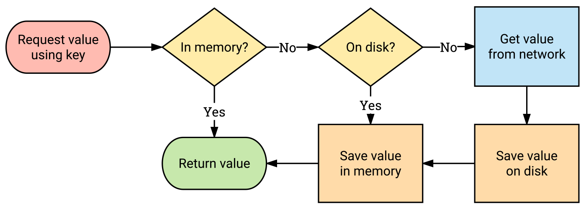

# layercache   [](https://codecov.io/gh/appmattus/layercache)

Caching made simple for Android and Kotlin.

An important component of building [offline-first architectures](https://developer.android.com/develop/quality-guidelines/building-for-billions-connectivity.html#network-duplicate) is to implement caching.

> An offline-first architecture initially tries to fetch data from local storage
> and, failing that, requests the data from the network. After being retrieved
> from the network, the data is cached locally for future retrieval. This helps
> to ensure that network requests for the same piece of data only occur
> once—with subsequent requests satisfied locally.



At its simplest, a cache is nothing more than a key-value store with a getter
and setter.

```kotlin
interface Cache<Key : Any, Value : Any> {
    suspend fun get(key: Key): Value?
    suspend fun set(key: Key, value: Value)
}
```

The real power comes when we are able to compose two caches into a new cache. A
memory cache should have a single responsibility to store data in memory, and a
disk cache a single responsibility to store data on disk.

```kotlin
val cache = memoryCache.compose(diskCache)
```

For more details read [Caching made simple on Android](https://medium.com/@appmattus/caching-made-simple-on-android-d6e024e3726b)
or watch the talk from [droidcon London 2017](https://skillsmatter.com/skillscasts/11062-lightning-talk-building-composable-caches-on-android).

## Getting started

### Base module

```kotlin
implementation("com.appmattus:layercache:<latest-version>")
```

#### Composing two caches

When `get` is called on the composed cache, the first cache will be checked and
if available returned. If not the second cache will be checked and if available
set in the first cache and returned.

```kotlin
composedCache: Cache<Key, Value> = firstCache.compose(secondCache)
```

#### Transforming values

Transform values between data types. This can be used for serialisation and
encryption amongst other things. i.e. `Cache<Key, Value> → Cache<Key, MappedValue>`

For two way transformations:

```kotlin
val cache: Cache<Key, Value> = ...
val valueTransform: Cache<Key, MappedValue> = cache.valueTransform(transform, inverseTransform)

// or

val cache: Cache<Key, Value> = ...
val valueTransform: Cache<Key, MappedValue> = cache.valueTransform(TwoWayTransform)
```

One way transforms return a Fetcher instead of Cache, but otherwise work in the
same way. A Fetcher simply implements no-op for `set` and `evict`.

```kotlin
val fetcher: Fetcher<Key, Value> = ...
val valueTransform: Cache<Key, MappedValue> = cache.valueTransform(transform)

// or

val fetcher: Fetcher<Key, Value> = ...
val valueTransform: Cache<Key, MappedValue> = cache.valueTransform(OneWayTransform)
```

##### Encrypting values

```kotlin
implementation("com.appmattus:layercache-android-encryption:<latest-version>")
```

There is support for encrypting string keys and string values (in any cache) on Android with the `layercache-android-encryption` module. The
library is using [Google Tink](https://github.com/google/tink) to perform the encryption using AES-256 SIV for keys and AES-256 GCM for values.

```kotlin
// Encrypt key and value when both are strings
val cache: Cache<String, String> = ...
val encryptedCache = cache.encrypt(context)

// Both key and value stored encrypted in `cache`
encryptedCache.set("hello", "world")

// Encrypt values only when just the value is a string
val cache: Cache<Key, String> = ...
val encryptedCache = cache.encryptValues(context)

// Just value stored encrypted in `cache`
encryptedCache.set("hello", "world")
```

#### Transforming keys

Transform keys to a different data type. i.e. `Cache<Key, Value> → Cache<MappedKey, Value>`

```kotlin
val cache: Cache<Key, Value> = ...
val keyTransform: Cache<MappedKey, Value> = cache.keyTransform(transform)

// or

val cache: Cache<Key, Value> = ...
val keyTransform: Cache<MappedKey, Value> = cache.keyTransform(OneWayTransform)
```

#### Re-using in flight requests

If a get request is already in flight then this ensures the original request is
returned. This may be necessary for disk and network requests along with
transformations that take time to execute.

```kotlin
val newCache: Cache<Key, Value> = cache.reuseInflight()
```

### Serializer module

```kotlin
implementation("com.appmattus:layercache-serializer:<latest-version>")
```

Configures a transformation from JSON to a serialisable data class and
vice-versa. This is useful to store data on disk or in a database.
i.e. `Cache<Key, String> → Cache<Key, Value>`

```kotlin
@Serialize
data class Value(val value)

val cache: Cache<Key, String> = ...

val objectCache: Cache<Key, Value> = cache.jsonSerializer(Value::class.serializer())

```

### Android base module

```kotlin
implementation("com.appmattus:layercache-android:<latest-version>")
```

#### LruCache

```kotlin
val memoryCache: Cache<Key, Value> = Cache.createLruCache(maxSize: Int)

// or

val memoryCache: Cache<Key, Value> = Cache.fromLruCache(...)
```

#### DiskLruCache

```kotlin
val diskCache: Cache<String, String> = Cache.createDiskLruCache(directory: File, maxSize: Long)

// or

val diskCache: Cache<String, String> = Cache.fromDiskLruCache(...)
```

#### SharedPreferences

Create a cache backed by shared preferences.

```kotlin
val sharedPreferences = context.getSharedPreferences("filename", Context.MODE_PRIVATE)

val anyValueCache: Cache<String, Any> =
        sharedPreferences.asCache()

val stringValueCache: Cache<String, String> =
        sharedPreferences.asStringCache()

val stringSetValueCache: Cache<String, Set<String>> =
        sharedPreferences.asStringSetCache()

val intValueCache: Cache<String, Int> =
        sharedPreferences.asIntCache()

val floatValueCache: Cache<String, Float> =
        sharedPreferences.asFloatCache()

val booleanValueCache: Cache<String, Boolean> =
        sharedPreferences.asBooleanCache()

val longValueCache: Cache<String, Long> =
        sharedPreferences.asLongCache()
```

##### EncryptedSharedPreferences

```kotlin
implementation("androidx.security:security-crypto:<latest-version>")
```

Use Jetpack Security to provide a cache backed by encrypted shared preferences where keys and values are both encrypted.

```kotlin

val masterKey = MasterKey.Builder(context).setKeyScheme(MasterKey.KeyScheme.AES256_GCM).build()

val sharedPreferences = EncryptedSharedPreferences.create(
    context,
    "filename",
    masterKey,
    EncryptedSharedPreferences.PrefKeyEncryptionScheme.AES256_SIV,
    EncryptedSharedPreferences.PrefValueEncryptionScheme.AES256_GCM
)

val anyValueCache: Cache<String, Any> =
        sharedPreferences.asCache()

val stringValueCache: Cache<String, String> =
        sharedPreferences.asStringCache()

val stringSetValueCache: Cache<String, Set<String>> =
        sharedPreferences.asStringSetCache()

val intValueCache: Cache<String, Int> =
        sharedPreferences.asIntCache()

val floatValueCache: Cache<String, Float> =
        sharedPreferences.asFloatCache()

val booleanValueCache: Cache<String, Boolean> =
        sharedPreferences.asBooleanCache()

val longValueCache: Cache<String, Long> =
        sharedPreferences.asLongCache()
```

### Android LiveData module

```kotlin
implementation("com.appmattus:layercache-android-livedata:<latest-version>")
```

Given a cache we can convert it for use with LiveData. This makes the getter
return a `LiveDataResult` which can be one of `Loading`, `Success` or `Failure`.

```kotlin
val liveDataCache = cache.toLiveData()

liveDataCache.get("key").observe(owner) { liveDataResult ->
    when (liveDataResult) {
        is LiveDataResult.Loading -> {
            // display in progress
        }
        is LiveDataResult.Success -> {
            // display liveDataResult.value
        }
        is LiveDataResult.Failure -> {
            // display liveDataResult.exception
        }
    }
}

```

## Download [ ](https://bintray.com/appmattus/maven/layercache/_latestVersion)

Available from jcenter()

```kotlin
dependencies {
    implementation("com.appmattus:layercache:<latest-version>")

    // To use with the Kotlin serializer
    implementation("com.appmattus:layercache-serializer:<latest-version>")

    // Provides support for ehcache
    implementation("com.appmattus:layercache-ehcache:<latest-version>")

    // Provides support for cache2k
    implementation("com.appmattus:layercache-cache2k:<latest-version>")

    // Provides LruCache & DiskLruCache support for Android
    implementation("com.appmattus:layercache-android:<latest-version>")

    // Provides one-line String encryption for Android
    implementation("com.appmattus:layercache-android-encryption:<latest-version>")

    // Provides conversion from Cache into LiveData for Android
    implementation("com.appmattus:layercache-android-livedata:<latest-version>")
}
```

## Contributing
Please fork this repository and contribute back using [pull requests](https://github.com/appmattus/layercache/pulls).

All contributions, large or small, major features, bug fixes, additional language translations, unit/integration tests are welcomed.

## License [](LICENSE)

Copyright 2020 Appmattus Limited

Licensed under the Apache License, Version 2.0 (the "License");
you may not use this file except in compliance with the License.
You may obtain a copy of the License at

    http://www.apache.org/licenses/LICENSE-2.0

Unless required by applicable law or agreed to in writing, software
distributed under the License is distributed on an "AS IS" BASIS,
WITHOUT WARRANTIES OR CONDITIONS OF ANY KIND, either express or implied.
See the License for the specific language governing permissions and
limitations under the License.
